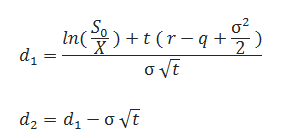
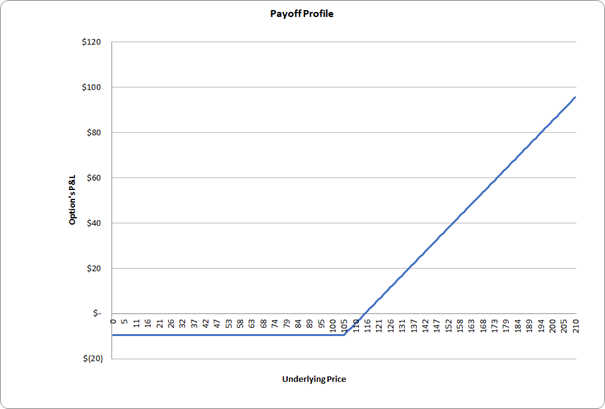
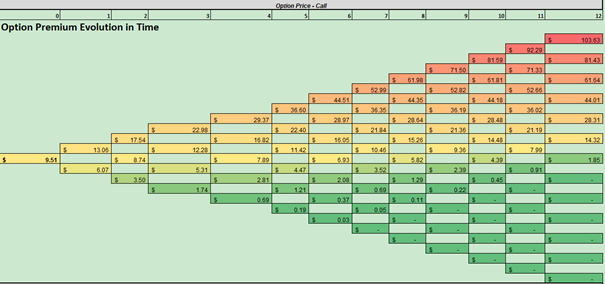
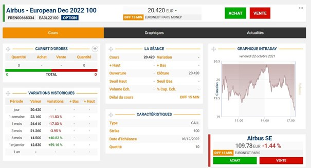
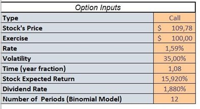
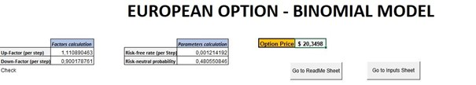
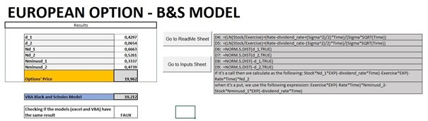

# Derivatives - Option Pricing

## TSM project - M2 FiRE

Authors :
Ilyès BOUSSOUF;
Jardiel DA SILVA ARAUJO JUNIOR;
Nabiil BUDUREEA;
Huifen Chen

# Momento

Before digging into the principles of our group assignment, let us have a quick momento on some pertinent course materials viewed in the previous lectures. Options, in finance, are financial derivatives, that convey its owner the right but not the obligation to buy or sell the underlying asset, leaving the other counterparty of the contract with the obligation to execute if the holder decides to execute his option.

There are two types of options, Call options which allow the owner to buy the underlying asset at strike price stated in the contract within a specific timeframe, and Put options that allow the owner to sell the underlying asset at the strike price stated in the contract within a specific timeframe.

Options remain a very strong financial tool, as they provide increased cost efficiency, and they may be less risky than equity. They are mainly used for hedging and speculation purposes.
 
In the implementation of our model, we will focus on European Options. European options are a version of options contract that unlike the American style options limits its execution to its maturity date. In other words, the holder of a European call or put option can not exercise his option whenever he wants but only at the expiration date specified in the contract.

Our aim with this model is to price European Call and Put Options only by using some information that is related to the option contract and the underlying asset, such as the strike price, the maturity date, the spot price of the asset. etc, by implementing them in the Binomial and Black-Scholes-Merton formula.

Since options are derivatives contracts, the movement in the price of the underlying asset up or down has a direct but not a proportional effect on the price of the option. That is why, these different pricing models are based also on other determining price factors, such as interest rates, risk-free rates, volatility, etc.

The document is structured as follows: the first part will discuss on the overview of the questions, the second part will explain the foundations of the Binomial and Black-Scholes-Merton model and a third part that will be a User Guide for the excel model.

## Foundations of the Black-Scholes-Merton formula

The Black-Scholes is a pricing model used to determine the fair price or theoretical value for a call or a put option based on six variables such as volatility, type of option, underlying stock price, time, strike price, and the risk-free rate. The quantum of speculation is more in the case of stock market derivatives, and hence proper pricing of options eliminates the opportunity for any arbitrage (The Economics Times). The use of this model is for the determination of a European call option, leading to the fact that the latter can be exercised only at the date of expiration.

## The assumptions of the Black-Scholes-Merton model

This option pricing model relies on a plethora of assumptions. Some of them are assumptions are the same as in financial models such as Sharpe (1964), Lintner (1965), and Mossin (1966) Capital Asset Pricing Model (CAPM) and some of them are different from the latter.
The elementary assumptions for the Black-Scholes model to be satisfied are as follows:
	The fact that there are no restrictions, taxes, and limitations on security tradings, these security markets are frictionless. 
	During the lifetime of the option, there are no additional payments from the underlying assets
	The risk-free interest rate is constant for the whole lifespan of the option, thus investors can borrow or lend at that same rate
	No riskless arbitrage opportunities
	Continuous trading in assets throughout time
	The price of the underlying asset has a lognormal distribution and evolves with continuous sample paths according to the Brownian motion process
	More is preferred to less by investors and they agree on the function of underlying asset’s variance σ2, which is considered to be constant

Considering the fact that these assumptions are satisfied, the Black-Scholes formula is obtained.

The mathematical formulae can be applied for both a call and a put option and is as follows:

where

with :

* N(𝑥) is the cumulative probability function for a variable with standard normal distribution N(0,1) with a mean of 0 and a variance of 1.
* C and P are the prices of European call and put options respectively
* S0 is the underlying asset  price
* X is the strike price
* σ is the volatility
* r is the continuously compounded risk-free interest rate
* q is the continuously compounded dividend yield 
* t is the time to maturity

# Foundations of the Binomial Option Pricing Model

The binomial option pricing model consists of an iterative approach, enabling the specification of nodes, during the time period between the valuation date and the option’s expiration date. Each iteration is segmented between two possible outcomes, a move up and move down that takes the shape of a binomial tree. 

## The assumptions of the Binomial Option Pricing Model

The binomial option pricing model assumes that the price of the underlying asset will move up or down by a specified amount over a period. Based on the assumption that asset prices in the future follow binomial distribution, the no-arbitrage price of options can be determined. The binomial option pricing is relatively simple in computation even if it can become tedious for the implementation of a multi-period model.
Compared with the black and Scholes model, the binomial model is useful for American options. The model provides empirical results according to the inputs we set, and the holder has the right to exercise at any time before expiration. Another significant advantage is the multi period view, which provides the transparency of the price and option value of the underlying asset over time.

## The underlying assumptions for the binomial option pricing model

* At every point in time, two possible outcomes of the price; a move up and a move down
* The underlying asset pays dividends
* The risk-free interest rate (discount factor) is continuously compounded throughout the period;
* The market is frictionless, and there are no transaction costs and no taxes
* Investors are risk-neutral, indifferent to risk

# Part I :  European option by given parameters 

Given by the following information and parameters, we designed a binomial model with continuously compounded dividends by 12 step trees.
Firstly, we collect all the parameters and calculate the payoff of the option, We have continuously compounded interest rate, r = 1%, σ = 20%, continuously compounded dividend δ = 3%,12 periods with the maturity time of one year. the expected return on the stock is µ = 10%. we assume this is a call option and set the strike price of the option to be $105, the stock price was given by $100.

1) We will model the stock returns of each period by u and d using the following equations.

u=e^(σ√h); d=e^(-σ√h)

where σ is the annual volatility, and h is the length of a binomial period in years.

We input the parameter and get :
* u=1.0594 (up-factor per step)
* d=0.9439 (down-factor per step)

We can check that the product between these two factors is equal to 1.

2) The risk-neutral probability in one period is p*=(e^rh -d)/(u-d), where r is the continuously compounded annual interest rate, δ is the continuous dividend yield, h is the length of a binomial period in years. u and d are the up and down factors per period.  We input the parameter and get p*=0.48.

3) The payoff of the call option at the maturity:

4) The result of the option price and the evolution of the option price and hedging ratio at all nodes of the binomial tree:

* The call option price using the binomial model is $5.1087
* The call option price using the Black & Scholes model is $5.017

* The put option price using the binomial model is $12.0643
* The put option price using the Black & Scholes model is $11.928

# Part II:  compared the result with a real option of Airbus SE

We calculate the daily return of Airbus’s stock prices, and get the annual volatility of the past 10 years of 35.22%. So we set the annual volatility of the stock to be 35%. The continuously compounded dividend of the stock is 1.88%. We choose the 10-years Treasury bond yield to be the risk-free rate, which is 1.59%.
From the market, we can find the stock price of Airbus SE is €109.78, the price(23/10/2021) of a call option of Airbus SE with the strike price of €100 is to be €20.42, the maturity time is 16/12/2022.

We input all the parameters in the model and generate the result.

The result of the binomial model is €20.3498.

The result of the black & Scholes model is €19.962.

	 

