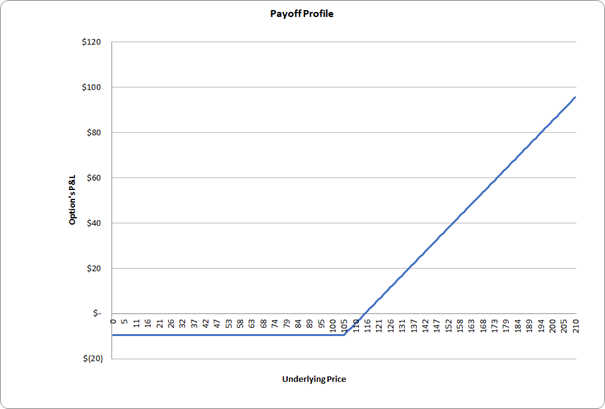
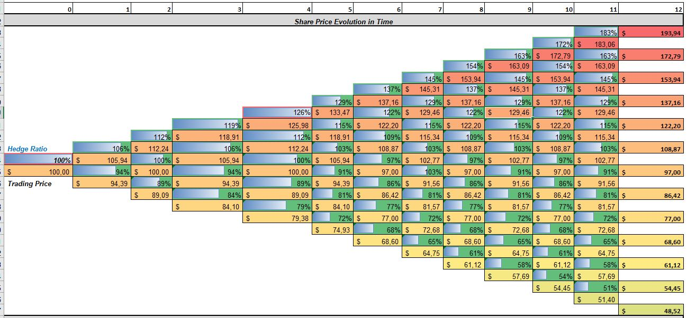
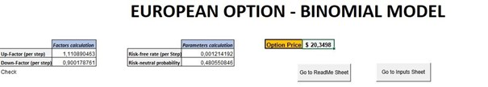
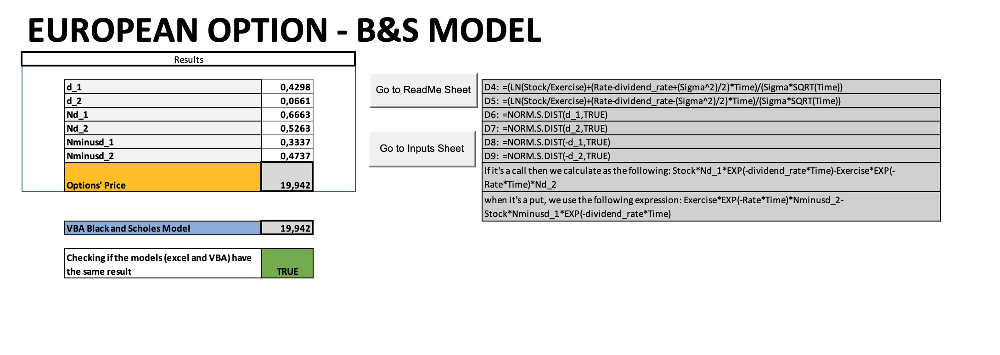
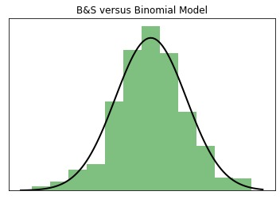

# Derivatives - Option Pricing

## TSM project - M2 FiRE

Authors :
Ilyès BOUSSOUF;
Jardiel DA SILVA ARAUJO JUNIOR;
Nabiil BUDUREEA;
Huifen Chen

**The Excel file to be used comprising our option pricing models can be found in the project repository and is titled *Derivatives_Project.xlsm***

# Momento

Before digging into the principles of our group assignment, let us have a quick momento on some pertinent course materials viewed in the previous lectures. Options, in finance, are financial derivatives, that convey its owner the right but not the obligation to buy or sell the underlying asset, leaving the other counterparty of the contract with the obligation to execute if the holder decides to execute his option.

There are two types of options, Call options which allow the owner to buy the underlying asset at strike price stated in the contract within a specific timeframe, and Put options that allow the owner to sell the underlying asset at the strike price stated in the contract within a specific timeframe.

Options remain a very strong financial tool, as they provide increased cost efficiency, and they may be less risky than equity. They are mainly used for hedging and speculation purposes.
 
In the implementation of our model, we will focus on European Options. European options are a version of options contract that unlike the American style options limits its execution to its maturity date. In other words, the holder of a European call or put option can not exercise his option whenever he wants but only at the expiration date specified in the contract.

Our aim with this model is to price European Call and Put Options only by using some information that is related to the option contract and the underlying asset, such as the strike price, the maturity date, the spot price of the asset. etc, by implementing them in the Binomial and Black-Scholes-Merton formula.

Since options are derivatives contracts, the movement in the price of the underlying asset up or down has a direct but not a proportional effect on the price of the option. That is why, these different pricing models are based also on other determining price factors, such as interest rates, risk-free rates, volatility, etc.

The document is structured as follows: the first part will discuss on the overview of the questions, the second part will explain the foundations of the Binomial and Black-Scholes model and a third part that will be a User Guide for the excel model.

## Foundations of the Black-Scholes

The Black-Scholes is a pricing model used to determine the fair price or theoretical value for a call or a put option based on six variables such as volatility, type of option, underlying stock price, time, strike price, and the risk-free rate. The quantum of speculation is more in the case of stock market derivatives, and hence proper pricing of options eliminates the opportunity for any arbitrage (The Economics Times). The use of this model is for the determination of a European call option, leading to the fact that the latter can be exercised only at the date of expiration.

## The assumptions of the Black-Scholes model

This option pricing model relies on a plethora of assumptions. Some of these are assumptions are the same as in financial models such as Sharpe (1964), Lintner (1965), and Mossin (1966) Capital Asset Pricing Model (CAPM).
The elementary assumptions for the Black-Scholes model to be satisfied are as follows :
* The fact that there are no restrictions, taxes, and limitations on security tradings, these security markets are frictionless 
* During the lifetime of the option, there are no additional payments from the underlying assets
* The risk-free interest rate is constant for the whole lifespan of the option, thus investors can borrow or lend at that same rate
* No riskless arbitrage opportunities
* Continuous trading in assets throughout time
* The price of the underlying asset has a log-normal distribution and evolves with continuous sample paths according to the Brownian motion process
* More is preferred to less by investors and they agree on the function of underlying asset’s variance σ^2, which is considered to be constant

Considering the fact that these assumptions are satisfied, the Black-Scholes formula is obtained.

The mathematical formula can be applied for both a call and a put option and is as follows:

where

with :

* N(𝑥) is the cumulative probability function for a variable with standard normal distribution N(0,1) with a mean of 0 and a variance of 1.
* C and P are the prices of European call and put options respectively
* S_0 is the underlying asset price
* X is the strike price
* σ is the volatility
* r is the continuously compounded risk-free interest rate
* q is the continuously compounded dividend yield 
* t is the time to maturity

# Foundations of the Binomial Option Pricing Model

The binomial option pricing model consists in an iterative approach, enabling the specification of nodes, during the time period between the valuation date and the option’s expiration date. Each iteration is segmented between two possible outcomes, a move up and move down that takes the shape of a binomial tree. 

## The assumptions of the Binomial Option Pricing Model

The binomial option pricing model assumes that the price of the underlying asset will move up or down by a specified amount over a period. Based on the assumption that asset prices in the future follow binomial distribution, the no-arbitrage price of options can be determined. The binomial option pricing is relatively simple in computation even if it can become tedious for the implementation of a multi-period model.
Compared with the Black and Scholes model, the binomial model is useful for American options. The model provides empirical results according to the inputs we set, and the holder has the right to exercise at any time before expiration. Another significant advantage is the multi period view, which provides the transparency of the price and option value of the underlying asset over time.

## The underlying assumptions for the binomial option pricing model

* At every point in time, two possible outcomes of the price : a move up and a move down
* The underlying asset can pay dividends or not (we chose to discount the dividends such that our final option pricing is consistent with our B&S computations and as close as possible with the real trading price of the option)
* The risk-free interest rate (discount factor) is continuously compounded throughout the period;
* The market is frictionless, and there are no transaction costs and no taxes
* Investors are risk-neutral, indifferent to risk

# Part I :  European option by given parameters 

Given by the following information and parameters, we designed a binomial model with 12 step trees.
Firstly, we collected all the parameters and calculate the payoff of the option. We have considered the continuously compounded interest rate, r = 1%, a volatility σ = 20%, a continuously compounded dividend δ = 3%, 12 periods with an option maturity time of one year. The expected return on the stock is µ = 10%. We will assume both a call and a put option and set the strike price of the option to be $105, the stock price being equal to $100.

1) We will model the stock returns of each period using two factors : u and d using the following equations.

u=e^(σ√h); d=e^(-σ√h)

where σ is the annual volatility, and h is the step/length of a binomial period in years.

We input the parameter and get :
* u=1.0594 (up-factor per step)
* d=0.9439 (down-factor per step)

We can check that the product between these two factors is equal to 1.

2) The risk-neutral probability in one period is p*=(e^(rh) -d)/(u-d), where r is the continuously compounded annual interest rate, δ is the continuous dividend yield, h is the length of a binomial period in years. u and d are the up and down factors per period.  We input the parameter and get p*=0.49.

3) The payoff of the call option at the maturity:

4) The result of the option price and the evolution of the option price and hedging ratio at all nodes of the binomial tree:

* The call option price using the binomial model is $5.1087
* The call option price using the Black & Scholes model is $5.017

* The put option price using the binomial model is $12.0643
* The put option price using the Black & Scholes model is $11.928

In parallel to the share price evolution that can be observed on the heat gradient, we computed the hedging ratio evolution at all nodes of the binomial tree.

The hedging ratio at a node of the binomial tree can be calculated using the following formula :

# Part II:  Pricing an European option : Airbus SE using our models

We calculate the daily return of Airbus’s stock prices, and get the annual volatility of the past 10 years of 35.22%. So we set the annual volatility of the stock to be 35%.
To compute this annual volatility, we compute the daily returns of the underlying stock. Using this distribution, we calculate its standard deviation and multiply it by square root of the number of trading days per year for this stock.

The continuously compounded dividend of the stock is 1.88%. We choose the 10-years Treasury bond yield to be the risk-free rate, which is 1.59%. This can be found easily on the internet on open-source financial platforms such as *Yahoo Finance*.

From the market, we can find that the stock price of Airbus SE is €109.78, the price (23/10/2021) of a call option of Airbus SE with a strike price of €100 is to be €20.42, the maturity time is 16/12/2022. We found these quotes on *Bourse Direct*, an open-source french financial platform.

*Source : Bourse Direct*

Using our Market data computations (see Excel file titled Airbus - Market Data), we input all the parameters in the model and generate the results.

The result using our binomial model is €20.3498.

The result using our Black & Scholes model is €19.962.

## Observations

Both computations of the Airbus option with both models are consistent with the trading price of the option on the market : €20.42

Even if our B&S computation has proved to be more accurate and robust in practice. However, in this case, the binomial model is the most accurate one. Which exposes the utility of such a model in some circomstances.
Furthermore, we can explain the slight relative uncertainty in our computations with the theoretical trading price by the inputs we used to compute the option price that are certainly not computed the same way as the analysts computed them for the quote pricing. As a matter of fact, the volatility and dividend yield computed are affected by sources of uncertainties such as the timeframe considered to calculate such inputs. In our case, we used a large timeframe to compute the volatilty. To optimize further the B&S computation, we think that by choosing a closer timeframe with the option issuing date computing the volatility, we can enhance our option pricing accuracy.
On the other hand, we estimate that our play on the dividend yield variable present in the inputs is very limited, this parameter optimization won't lead to significative accuracy enhancement.

# Models Stability & Flexibilty observations - Limitations

## Black & Scholes Model

Our model has proven to be robust and accurate in all the configurations we set it up for the option pricing. No deviations from the theoretical price (calculated using B&S pricing calculators online) have been noticed. Plus, by computing the B&S model using both an Excel & VBA approach allow us to enhance further our model reliability. As a matter of fact, the pricing performed by these two approaches (Excel & VBA) give always the same result at 10^-3.

Regarding now the flexibility of the model, we can easily and quickly switch from inputs to pricing computations using our model. By trials and errors using multiple inputs, we find that this method is the most reliable one. This observation is consistent with the fact that B&S is most commonly used in the industry to perform option pricing.

However, some observations made the Binomial Model relevant and interesting in some configurations.

## Binomial Model

As a matter of fact, we noticed that for the Airbus option pricing, the binomial model proved to be more accurate than the B&S model with a maturity time of 1 year, the result was closer to the real trading price.
We can notice an enhanced accuracy of this model for option maturity times close to 1 year, which was the case with our Airbus option pricing. This could be explained by the binomial tree decomposition in 12 periods in adequation with the matuirty time, which allowed to increase our digits decomposition and expand our scalability whereas the linear model of the B&S strategy only enabled a capped accuracy.

Both the binomial model and the Black-Scholes formula are based on the risk-neutral free policy, the Black-Scholes formula is a limiting case of the binomial formula for the price of a European option. In other words, if the binomial model can divide the time into infinite periods, they are the same. But the derivation of the Black-Scholes formula makes a assumption of continuous and continuously compounded returns on the stock are normally distributed. For the binomial, it’s discrete which allows us to exercise the option at any point of the periods. So binomial model can work effectively with a complex option such as paying discrete dividends, American options which may exercise the option before the expiration. The Black-Scholes formula is more suitable for the European option which doesn’t allow to exercise in advance.

However, we advise the user to always keep a critical eye on this binomial method. As a matter of fact, we notice that our pricing accuracy degrade when we decrease or increase the maturity time, the most stable point being at 1 year of maturity.

Hence, to price an option with a matuity of few weeks or numerous years, we will privilege the B&S approach which will enable reliability and robustness.

This can be due to the fact that the B&S model relies its computation on a normal distribution, continuously whereas the binomial model performs its computation discretly segmented in numerous steps. On one hand, the normal distribution will enable a stable accuracy on its "legs" deviating from its optimium stability point whereas the binomial model accuracy will decrease relatively to the B&S model due to this discrete compuatation (see Plot 1).

On the other hand, for options with 1 year of maturity, regarding our observations performing both models on several underlying assets, we will prefer the Binomial Model accuracy, regularly closer to the real trading price. Deviating from this maturity of 1 year, we will always choose the B&S appraoch.

	 

