# Derivatives
# Group Assignment 2
# Option Pricing an American or Exotic Option (Asian Option)

## TSM project - M2 FiRE

Authors :
Ilyès BOUSSOUF;
Jardiel DA SILVA ARAUJO JUNIOR;
Nabiil BUDUREEA;
Huifen CHEN

**The Excel file to be used comprising our option pricing models can be found in the project repository and is titled *Derivatives_Project_File.xlsm***

# Momento

Like it was thoroughly substantiated in the last assignment, there are two types of options, Call options which allow the owner to buy the underlying asset at strike price stated in the contract within a specific timeframe. 
On the other hand, Put options allow the owner to sell the underlying asset at the strike price stated in the contract within a specific timeframe. 

A plethora of method exist to price options, for instance, as previously studied in the previous lectures and assignment, the Binomial tree calculates the value of an asset over a series of time steps. In this stepwise process, the asset price can go up or down based on the up and down probability. The value of the option is sequentially computed at each point in the tree, that is from the final to its initial point. 

In this vein, the objective of this assignment is based on the applications to the pricing of an American or Exotic option, using the Monte Carlo Simulations by the means of Excel and VBA. For our case, our focal point will be laid on American options. 

The document is structured as follows: the first part will explain the foundations of the Monte Carlo simulation method, the second part will focus on pricing an Asian option by Binomial model and the third part will discuss pricing an American option in different methods like binomial model or Monte Carlo simulation based on continuous stochastic process model. 

# Foundation of Monte Carlo Simulation method on pricing options

Monte Carlo simulation is a random simulation calculation approach based on probability statistics and random sampling. According to the reference book ("Derivatives market" by Robert L.Mcdonald), Monte Carlo valuation on options depends critically on risk-neutral valuation. It is performed using the risk-neutral distribution, where we assume that assets earn the risk-free rate on average and then discount the expected payoff using the risk-free rate. In Monte Carlo valuation, we perform a calculation bast on BMS (continuous stochastic process) similar to that in this equation:

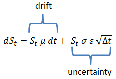

where the different parameters are those we commonly refer to in financial markets (spot price, volatility, expected return, drift).

The pros and cons of Monte Carlo valuation are as follows:
* It is very suitable for the high-dimensional option, which is determined by its error convergence rate characteristics. In the case of low dimension, its speed is slower than Traditional numerical methods such as the binomial tree method and finite difference method.

* The Monte Carlo method can price many options, especially path-dependent options. If the simulation process is slightly modified, it can be efficiently priced without too much mathematical derivation.

*	Numerous simulations can get more accurate results. Many empirical studies regarding the Monte Carlo estimates are valid because of its thousands of simulations and then test the other results as a benchmark.

*	The development of computer technology strongly supports the Monte Carlo method. Many software has inside programs to generate random variables, and the high-quality hardware dramatically reduces the calculation time when applying the Monte Carlo method.

* One of the disadvantages of the Monte Carlo method is that it is not suitable to price an American option that can be exercised in advance. 

*	The least-square Monte Carlo simulation method proposed by Longstaff \ Schwartz is a widely used standard method in pricing American options by the Monte Carlo valuation. 

# Part I :  Asian option by given parameters

In this part, we designed a binomial model by VBA with continuously compounded dividends to price an Asian option.

Asian option is one of the exotic option which based on the average price over some period of time, so it is an example of a path-dependent option. Normally, asian options are worth less than other equivalent ordinary options due to the less volatitly of the averaged price of the underlying asset.

The given parameters are following:

* r = 1% (risk-free rate, continuously compounded)

* σ = 20%(volitality)

* δ = 3% (continuously compounded)

* µ = 10% (expected return)

* T= 1 month

* n=30 (each period 1 day)

* S0=$100

To constantly update the data to be considered as a strike price for the asian option pricing, we implemenented a Power Query request which updates in real-time the data to be considered in the market, average it and consider it in the pricing process. To do so, the user must specify the trading date in the "Inputs file" for the data to be considered from this specific trading date to the final date when the user performs the pricing.

1) Considering deviation of paying compounded dividend, we will model the stock returns of each period by u (up-factor per step) and d (down-factor per step) using the equations.

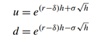

where r is the continuously compounded annual interest rate, δ is the continuous dividend yield, σ is the annual volatility, and h is the length of a binomial period in years.

We input the parameter and get u=1.0105, d=0.9895.

2) The risk-neutral probability formula in one period is

where r is the continuously compounded annual interest rate, δ is the continuous dividend yield, h is the length of a binomial period in years. u and d are the up and down factor per period.

We input the parameter and get p*=0.4974.

3) According to the given formula, we use the arithmetic average of realized stock prices as the strike price on day K.

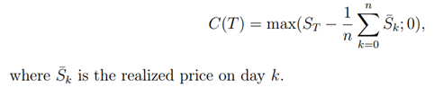

then the payoff of the call option is the area between the max prices and strik price(the average prices):

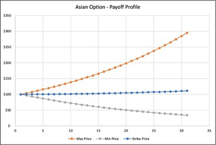

4) the heding ratio formula :

The call option price and hedging ratio at all nodes of the binomial tree:

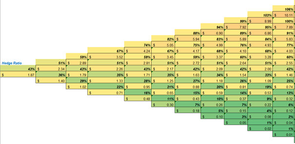

# Part II :  price an American Option 
In this part, we designed a VBA model to price an American option using binomial model and Monte carlo simulation(short for MCS) based on a discrete stochastic process(binomial distribution)

1) The market price of the target asset (APPLE)is following:
Stock price =$114.90, Strike price=$100, quoted call price=$15.15, quoted put price=$3.09, Matrurity time= 60 days

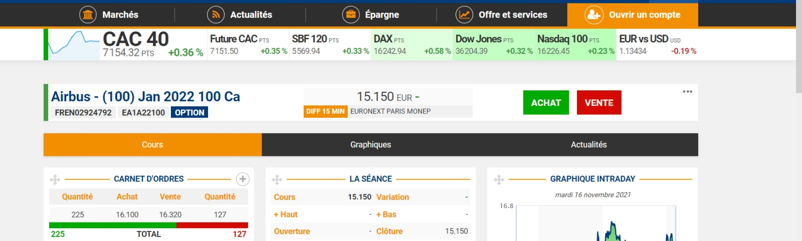   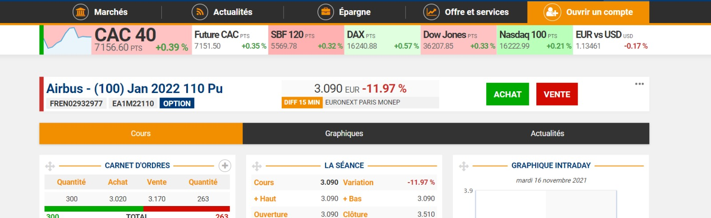

2) Data collecation and computation of the characteristics of the stock

We calculate the daily return of Apple stock prices, and compute the daily volatility of the stock, then we use the formula(daily volatility * √252 ) to get the annual volatility 35%. 

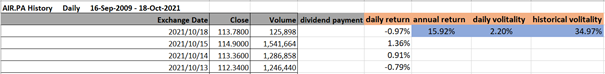

We get the dividend payments of Apple stock, and calculate both the annual dividend yield and the average annual dividend yield. Further to get the compute the continuously compound dividend, we use δ = ln(1+average annual dividend yield) to get the continuously compound dividend yield. The continuously compound dividend of the stock δ = 1.86%.

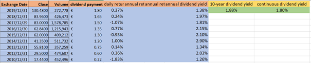

We choose 10-year treasury bond yield to be the risk free rate, r=1.59%.

The main characteristics for the option 

* Expected return µ =10%

* Volitality σ =35%

* dividend δ = 1.88%

* r = 1.59% 

* T=  60 days

3) We input all the parameters in the model and generate the result. 

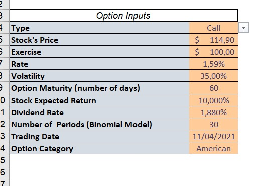

The call price of american option is €31.75.

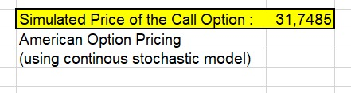

The put price of american option is €6.14.

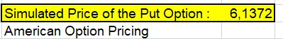

# Models Stability & Flexibilty observations - Limitations

## Monte Carlo Model

Our VBA model using Monte Carlo simulations on BMS (continuous stochastic approach) has proven to have an order of magnitude consistent with the real option prices in the different configurations we set it up for american options. However, this VBA model is not precise to price american options or asian options as our app. Indeed, we moticed that the expected returns and the volatility movements are highly impacting our final option pricing process. Plus, the number of simulations that can be ran using our VBA model is capped to few hundreds simulations (otherwise, the runtime is going to take a while and the file can crash - we advise the user to use 100 simulations or 200 max). On the other hand, our app simulations proved to be very accurate, robust, very fast. In practise, we noticed just small deviations from theoretical options prices for both american and asian options. Using this app, no deviations from the theoretical price have been noticed. Hence, by computing the Monte Carlo model using both our VBA & app approach allow us to enhance further our model reliability, and most importantly allow us to understand the critical aspects of monte carlo simulations on VBA.

Pricing american options, one must consider the continuation value of the option given that he can exercize the option before maturity. To add this continuation value to a typical european we used the LSM technique (Least-Squares Monte Carlo approach). With this consideration, we find that the actual price converges to the true price.

Regarding now the flexibility of the model, we can easily and quickly switch from inputs to pricing computations using our model.
On our app, we can change the inputs, running Monte Carlo in parallel to the vba process, which would enable to compare the pricing for two different configurations at the same time.
By trials and errors using multiple inputs on our app, we find that this Monte Carlo method is the most reliable one. This observation is consistent with the fact that Monte Carlo simulations using continuous stochastic aprroach is most commonly used in the industry to perform option pricing.

A button on the excel sheet allowing to execute the app would have been more handy to the user. Indeed, for now he has to execute the file located in the folder for now. So, he must run it "by hand" in parallel to the excel sheet instead of being totallu incorporated to the file. This can be seen as a limitation of our pricing model.

However, some observations made the Binomial Model relevant and interesting in some configurations.

## Binomial Model

As a matter of fact, we noticed that for the Airbus option pricing, the binomial model proved to be more accurate than with our Monte Carlo VBA Simulations (with 200 simulations) considering various maturities.
Furthermore, we can notice an enhanced accuracy of this model for option maturity times close to 1 year, which was the case with our Airbus option pricing. This could be explained by the binomial tree decomposition in 12 periods in adequation with the maturity time, which allowed to increase our digits decomposition and expand our scalability whereas the linear model of the B&S strategy only enabled a capped accuracy.

Both the binomial model and the Black-Scholes formula are based on the risk-neutral free policy, the Black-Scholes formula is a limiting case of the binomial formula for the price of a European option. In other words, if the binomial model can divide the time into infinite periods, they are the same. But the derivation of the Black-Scholes formula makes a assumption of continuous and continuously compounded returns on the stock are normally distributed. For the binomial, it’s discrete which allows us to exercise the option at any point of the periods. So binomial model can work effectively with a complex option such as paying discrete dividends, American options which may exercise the option before the expiration. The Black-Scholes formula is more suitable for the European option which doesn’t allow to exercise in advance.

However, we advise the user to always keep a critical eye on this binomial method. As a matter of fact, we notice that our pricing accuracy degrade when we decrease or increase the maturity time, the most stable point being at 1 year of maturity.

To price an option with a maturity of few weeks or numerous years, we will privilege the Monte Carlo approach ran in our app which will enhance reliability and robustness for both asian and american options pricing.

This can be due to the fact that first, the B&S model relies its computation on a normal distribution, continuously, whereas the binomial model performs its computation discretly segmented in numerous steps. On one hand, the normal distribution will enable a stable accuracy on its "legs" deviating from its optimium stability point whereas the binomial model accuracy will decrease relatively to the B&S model due to this discrete compuatation (see Plot 1).
Plus, the Monte Carlo approach allow to run numerous times the BMS simulation, applying it a shock at each iteration and averaging the results computed. This is a statistically more stable approach which will enable less error measurements on our final option price than the binomial approach. As a matter of fact, we notice after numerous trials that the Monte Carlo simulation filter all the noise in our option price using the app for simulation number above 10000 (this number of simulations can't be computed using our VBA model only with our app).

On the other hand, for options with 1 year of maturity, regarding our observations performing both models on several underlying assets, we will prefer the Binomial Model accuracy, regularly closer to the real trading price. Deviating from this maturity of 1 year, we will always choose the B&S appraoch.

## Extra

In order to optimize our model flexibility, we implemented a Power Query request that enables to directly access the market data in real time. Doing it, we can always have the volatility of the underlying asset up-to-date. However, to enhance further this process flexibility we could think of getting the historical dividends as well. That way, both volatility and dividends would be available to the user in real-time and for all the listed stocks on financial markets (available on the **Yahoo Finance** website).

