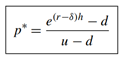
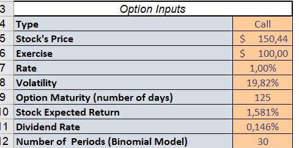

# Financial Derivatives - group assginment 2-Option Pricing an American or exotic option 

## TSM project - M2 FiRE

Authors :
Ilyès BOUSSOUF;
Jardiel DA SILVA ARAUJO JUNIOR;
Nabiil BUDUREEA;
Huifen CHEN

**The Excel file to be used comprising our option pricing models can be found in the project repository and is titled *Derivatives_Project_File.xlsm***

# Momento
Like it was thoroughly substantiated in the last assignment, there are two types of options, Call options which allow the owner to buy the underlying asset at strike price stated in the contract within a specific timeframe. 
On the other hand, Put options allow the owner to sell the underlying asset at the strike price stated in the contract within a specific timeframe. 

A plethora of method exist to price options, for instance, as previously studied in the previous lectures and assignment, the Binomial tree calculates the value of an asset over a series of time steps. In this stepwise process, the asset price can go up or down based on the up and down probability. The value of the option is sequentially computed at each point in the tree, that is from the final to its initial point. 

In this vein, the objective of this assignment is based on the applications to the pricing of an American or Exotic option, using the Monte Carlo Simulations by the means of Excel and VBA. For our case, our focal point will be laid on American options. 

The document is structured as follows: the first part will explain the foundations of the monte Carlo simulation method, the second part will focus on pricing an Asian option by Binomial model and the third part will discuss pricing an American option in different methods like binomial model or monte Carlo simulation based on discrete stochastic process model. 

# Foundation of Monte Carlo Simulation method on pricing options
Monte Carlo simulation is a random simulation calculation approach based on probability statistics and random sampling. According to the reference book(derivatives market by Robert L.Mcdonald), Monte Carlo valuation on options depends critically on risk-neutral valuation. It is performed using the risk-neutral distribution, where we assume that assets earn the risk-free rate on average and then discount the expected payoff using the risk-free rate. In monte Carlo valuation, we perform a calculation similar to that in this equation:

where ST is n randomly drawn time T stock prices, payoff V(ST,T), the time-0 price, V(S0,0).

The pros and cons of Monte Carlo valuation are as follows:
* It is very suitable for the high-dimensional option, which is determined by its error convergence rate characteristics. In the case of low dimension, its speed is slower than Traditional numerical methods such as the binomial tree method and finite difference method.

* The Monte Carlo method can price many options, especially path-dependent options. If the simulation process is slightly modified, it can be efficiently priced without too much mathematical derivation.

*	Numerous simulations can get more accurate results. Many empirical studies regarding the Monte Carlo estimates are valid because of its thousands of simulations and then test the other results as a benchmark.

*	The development of computer technology strongly supports the Monte Carlo method. Many software has inside programs to generate random variables, and the high-quality hardware dramatically reduces the calculation time when applying the Monte Carlo method.

* One of the disadvantages of the Monte Carlo method is that it is not suitable to price an American option that can be exercised in advance. 

*	The least-square Monte Carlo simulation method proposed by Longstaff \ Schwartz is a widely used standard method in pricing American options by the Monte Carlo valuation. 

# Part I :  Asian option by given parameters 
In this part, we designed a binomial model by VBA with continuously compounded dividends to price an Asian option.

Asian option is one of the exotic option which based on the average price over some period of time, so it is an example of a path-dependent option. Normally, asian options are worth less than other equivalent ordinary options due to the less volatitly of the averaged price of the underlying asset.

The given parameters are following:

* r = 1% (risk-free rate, continuously compounded)

* σ = 20%(volitality)

* δ = 3% (continuously compounded)

* µ = 10% (expected return)

* T= 1 month

* n=30 (each period 1 day)

* S0=$100

1) considering deviation of paying compounded dividend, we will model the stock returns of each period by u(up-factor per step) and d (down-factor per step) using the equations.

    
where r is the continuously compounded annual interest rate, δ is the continuous dividend yield, σ is the annual volatility, and h is the length of a binomial period in years.

We input the parameter and get u=1.0105, d=0.9895.

2) The risk-neutral probability fumula in one period is

    
where r is the continuously compounded annual interest rate, δ is the continuous dividend yield, h is the length of a binomial period in years. u and d are the up and down factor per period.  

We input the parameter and get p*=0.4974.

3) According to the given formula, we use the arithmetic average of realized stock prices as the strike price on day K.

then the payoff of the call option:

xxxxx xxxxx

The call price will be:

xxxxx xxxxx

4) the heding ratio formula:

The option price and hedging ratio at all nodes of the binomial tree:

# Part II :  price an American Option 
In this part, we designed a VBA model to price an American option using binomial model and Monte carlo simulation(short for MCS) based on a discrete stochastic process(binomial distribution)

1) The market price of the target asset (APPLE)is following:
Stock price =$150.44, Strike price=$100, quoted call price=$51.74, quoted put price=$0.58, Matrurity time= 125 days(March/18/2022)

   

2) Data collecation and computation of the characteristics of the stock

We calculate the daily return of Apple stock prices, and compute the daily volatility of the stock, then we use the formula(daily volatility * √252 ) to get the annual volatility 19.82%. 

We get the dividend payments of Apple stock, and calculate both the annual dividend yield and the average annual dividend yield. Further to get the compute the continuously compound dividend, we use δ = ln(1+average annual dividend yield) to get the continuously compound dividend yield. The continuously compound dividend of the stock δ = 0.146%.

We choose SOFR monthly rate to be the risk free rate, r=0.05%.

The main characteristics for the option 

* Return µ =1.581%

* Volitality σ =19.82%

* continuously compounded dividend δ = 0.146%

* r = 1.0% 

* T=  125 days

3) We input all the parameters in the model and generate the result. 

The call price of american option is €51.92.

The put price of american option is €0.2076.

4) Conclusion and Observations

